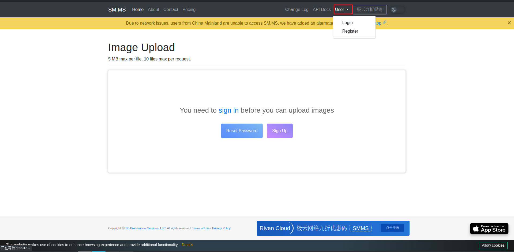
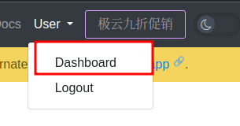
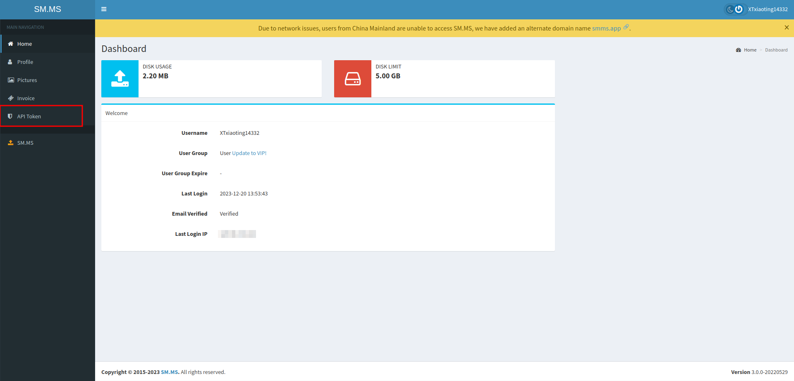
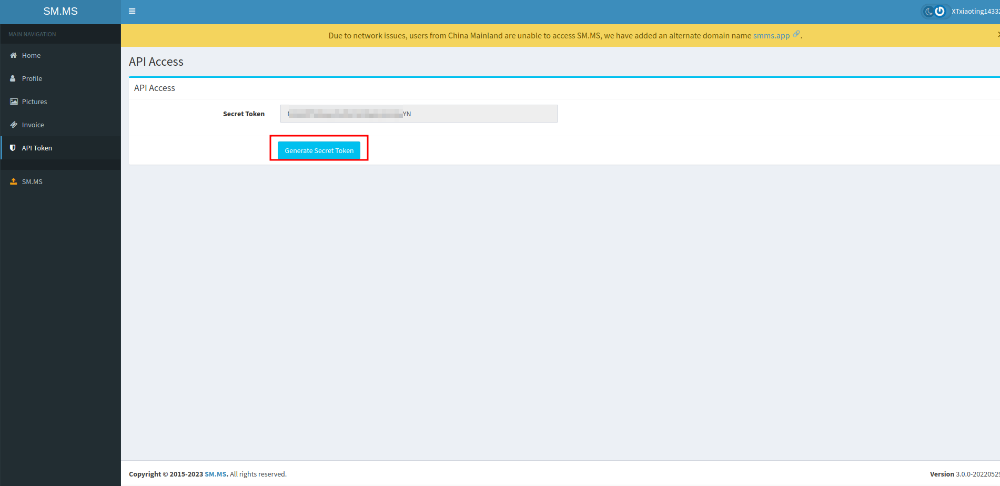

<div align="center">
  <a href="https://v2.nonebot.dev/store"></a>
  <br>
  <p></p>
</div>

<div align="center">

# nonebot-plugin-phigros-qq

_✨ 一个简单的基于PhigrosLibrary的Phigros查分插件，适用于Adapter-qq✨_


<a href="./LICENSE">
    
</a>
<a href="https://pypi.python.org/pypi/nonebot-plugin-phigros">
    
</a>


</div>


## 📖 介绍

一个简单的基于PhigrosLibrary的Phigros查分插件，适用于Adapter-qq<br>
使用/phi命令查看完整指令列表


## 💿 安装

<details open>
<summary>使用 nb-cli 安装</summary>
在 nonebot2 项目的根目录下打开命令行, 输入以下指令安装

    nb plugin install nonebot-plugin-phigros

</details>

<details>
<summary>pip安装</summary>

    pip install nonebot-plugin-phigros

打开 nonebot2 项目根目录下的 `pyproject.toml` 文件, 在 `[tool.nonebot]` 部分追加写入

    plugins = ["nonebot_plugin_phigros"]
</details>
<details>
<summary>Github下载</summary>
手动克隆本仓库或直接下载压缩包，将里面的nonebot_plugin_phigros文件夹复制到src/plugins中
**记得安装Pillow和httpx库**
</details>


</details><br>

# 获取sm.ms图床token
## 1）访问sm.ms图床网站并点击"User"->"Register"注册（如已有账号请直接点击"Login"登录）<br>
<a href="https://sm.ms">点我访问</a><br>



<br>

##  2）点击Dashboard



<br>

## 3）获取Token



<br>
Secret Token中的内容即为你的sm.ms图床token

<br><br>

## 配置Phigros API
**(需要安装Java 17)**
<h2>访问<a href="https://hub.xb6868.com/7aGiven/PhigrosLibrary/">PhigrosLibrary项目</a></h2>

1）在PhigrosLibrary项目的Releases页面中找到<a href="https://hub.xb6868.com/7aGiven/PhigrosLibrary/releases/tag/v3.1.0">PhigrosLibrary-3.1.0</a>，并下载其中的``PhigrosRpc-nojre-3.1.0.zip``<br>
2）解压压缩包后需要先**替换其中的difficulty.csv才能正常使用**<br>
<a href="https://hub.xb6868.com/7aGiven/PhigrosLibrary?tab=readme-ov-file#phigros-%E6%9B%B2%E7%9B%AE%E6%9B%B4%E6%96%B0">点我查看替换教程</a><br>
3）使用以下命令启动Phigros API

```
java -jar PhigrosRpc-3.1.0-all.jar 9090
```

其中``9090``为API的端口


<br><br>

## 🔧配置项
### 必填项

```
#sm.ms图床的Token，不填则无法发送图片
phigros_smms_token = 你的sm.ms的用户token
```

### 非必填项

```
#PhigrosLibrary的api地址，默认为http://127.0.0.1
phigros_api_host = http://127.0.0.1

#PhigrosLibrary的api端口，默认为9090
phigros_api_port = 9090

# 字体文件路径
phigros_font_path = 你的字体路径

# 字体大小，单位px，默认为18
phigros_font_size = 18
```


<br>

## 🎉 使用
### 指令表（需要加上命令前缀，默认为/）
| 指令 | 权限 | 需要@ | 范围 | 说明 |
|:-----:|:----:|:----:|:----:|:----:|
| phi | 所有人 | 是 | 群聊 | 显示完整指令列表 |
| phi bind [token]| 所有人 | 是 | 群聊 | 绑定Phigros账号 |
| phi unbind | 所有人 | 是 | 群聊 | 解除绑定 |
| phi b19| 所有人 | 是 | 群聊 | 获取b19成绩 |
| phi info| 所有人 | 是 | 群聊 | 获取个人概览 |